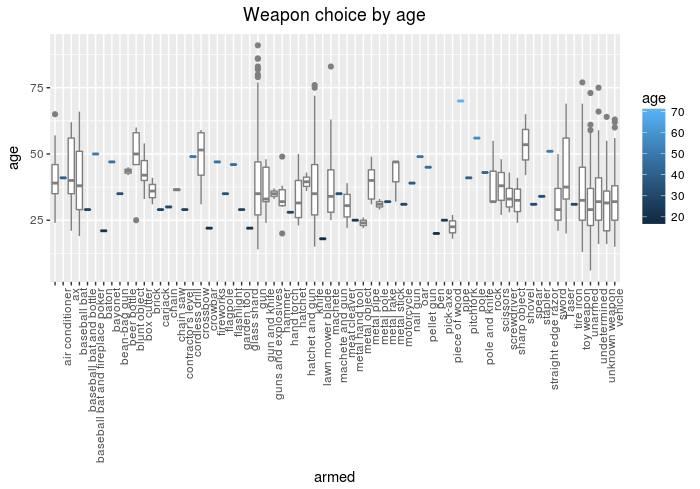
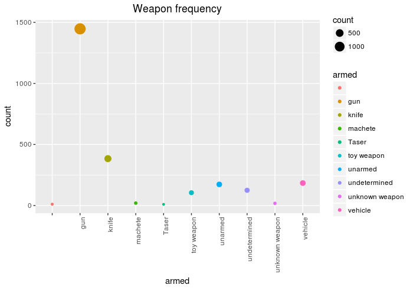

# fatal_police_shootings
Exploratory Data Analysis on fatal-police-shootings-data.csv

The csv data is from repository: https://github.com/washingtonpost/data-police-shootings.git

Local copy in data/fatal-police-shootings-data.csv

Required packages:
readr
ggplot2
dplyr
RCurl

 

 
